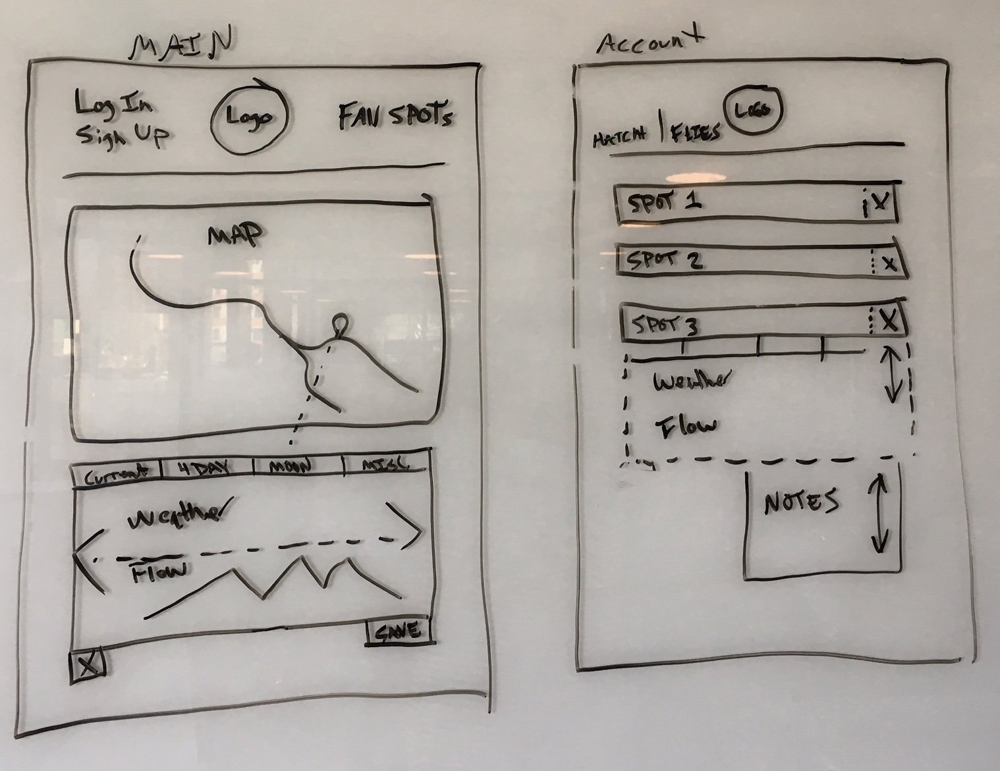

# fishHappens: a fly fishing app

# [Link to Heroku](https://lit-lake-26661.herokuapp.com/)

# [Link to our Trello](https://trello.com/b/vDSXXHKg/fish-happens-app-development)

## fishHappens is a fishing app that quickly grabs weather and stream flow data on a click of a map.  Instead of forcing the user to choose specific fishing spots to pull data, fishHappens lets you choose the spot you want data for.  After selecting a spot, data is presented in a dropdown separated by current and 4 day information.  Current has weather, elevation, and stream flow data in a graph.  The four day shows the forecast.  The user can save the spot's coordinates to the database and grab data for any saved spots with the push of a button.

## Wireframe

# Using the App

From the landing page, choose whether to go to the home page or the about page (info about the development team).  The home page is where seaching can take place.  Navigate around the map until you find a spot worth checking out.  Drop a pin and open the click panel below the map.  The panel should display weather and stream info for the spot you picked.  Navigate between the current and four day tabs to see current or future data.  You can hit the 'save spot' button and the location's coordinates will be saved in the database.
Navigate to the user page by clicking your name in the top right corner (assuming you have created an account and logged in first).  The locations you have saved will be displayed in a list.  From here, you can choose to delete a spot or get data for a spot.  The data button will display the current conditions for the location just like the search page displays.
There is a hatch chart page that displays the current insect varieties for Colorado.

# Route map

* (/signup) Create a new account
* (/login) Login to account
* (/home) Search for spots page
* (/) Landing page
* (/about) About the dev team
* (/profile) User saved spots
* (/hatches) Hatch chart
* (/patterns) Fly patterns

# Research findings

Results show that weather and moon cycles (fishing times) are the most important.  Other categories receiving votes are: waterflow data, fly recommendations, sharing to friends, logging location notes.
(Expert)
* Considers time of day, type of fish, visual topography and water conditions.
* Same spot if few hours, different spots if more time.
* Looks online for info, local specific only
* Wants to save notes and save spot info
* Would share spots with friends

# Technologies used

* Satellizer
* Sequelize
* Sequellizer
* Bcrypt
* Chart.js
* Express
* Request
* CSS
* Moment
* jQuery
* Bootstrap
* Angular
* UI Router

# Future Plans

* Adding moon data with fishing times
* Adding notes for favorite spots
* Saving snapshot of current weather for spot with notes
* Favorite spots save for users
* Custom fly pattern and hatch chart recommendations
* Ability to share a spot/post link
* Nearby photos/videos from location

# Contributers

## Tyler Shockey
Tyler is the fearless leader, he helped pull us up by our bootstrap CDN's when we were feeling down.

## Bob Schank
Bob really loves SQL and fishing.  He was the chart master and template wizard.

## Alex Creighton
Alex writes great comments.  He was the Heroku sensei and design specialist.   

